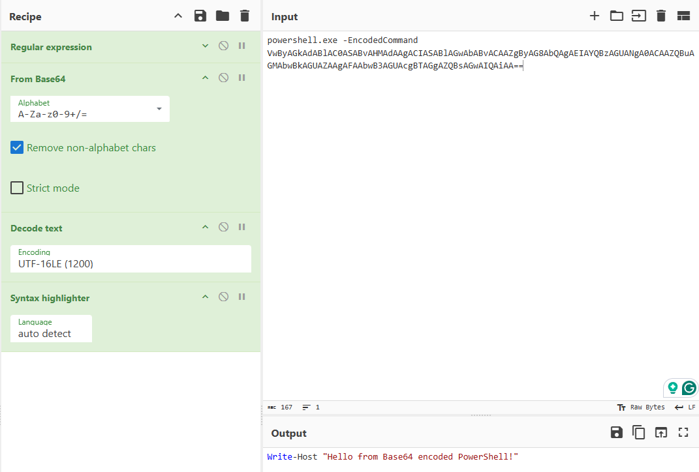
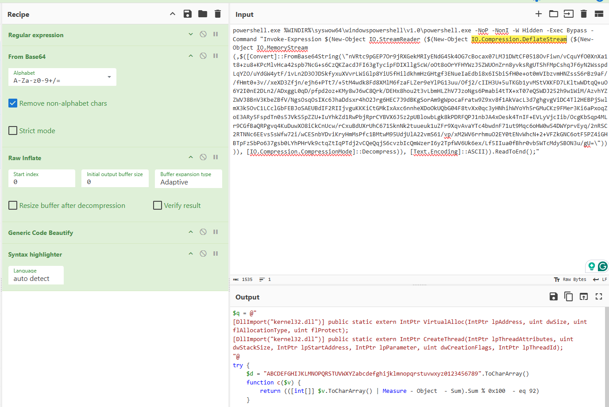
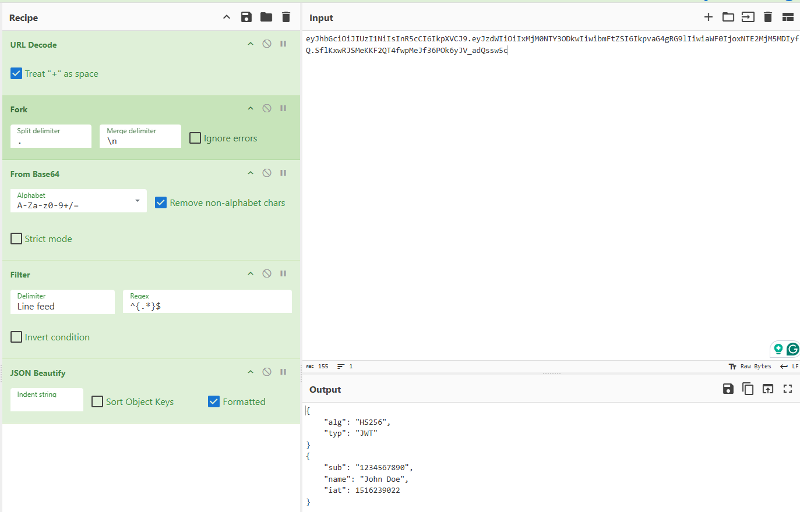
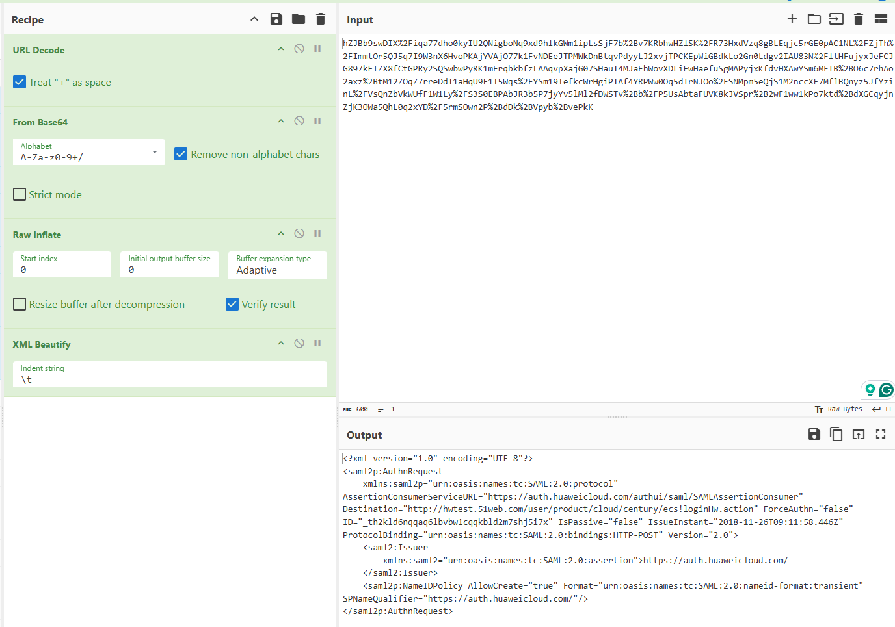
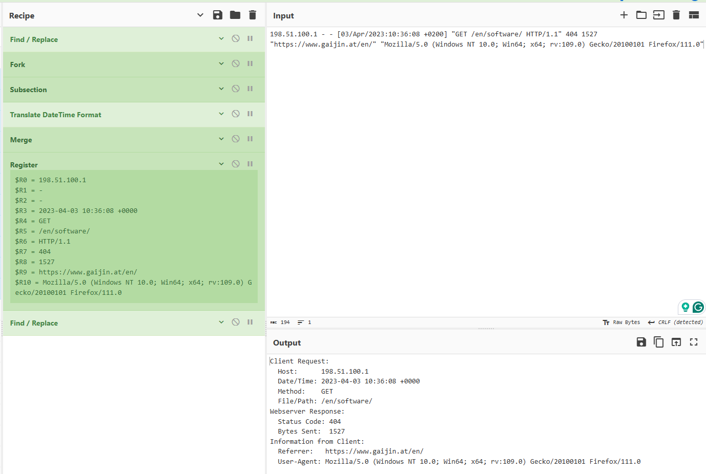
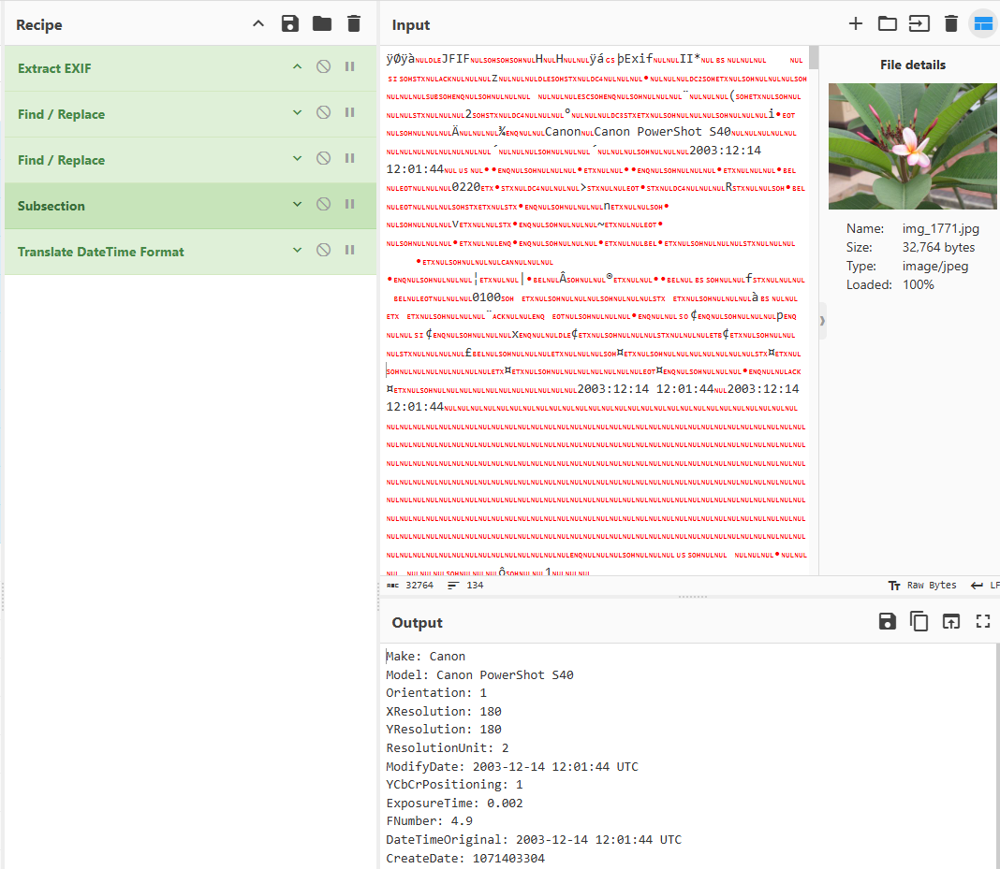
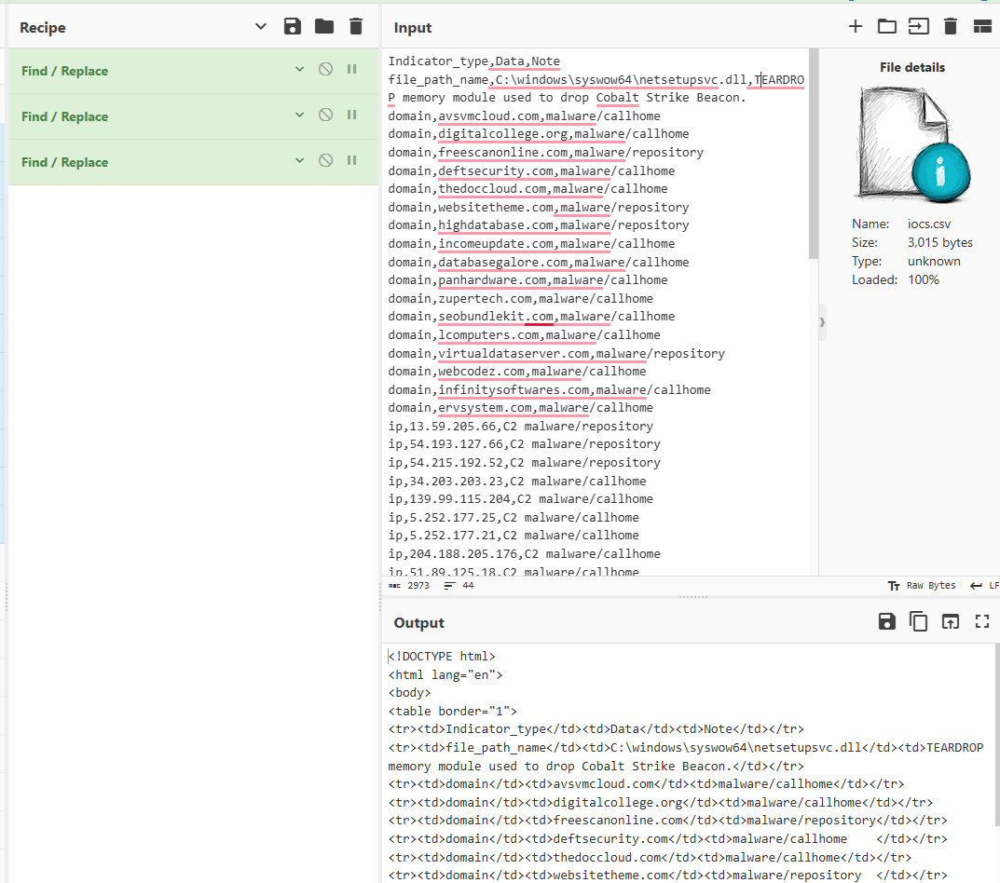
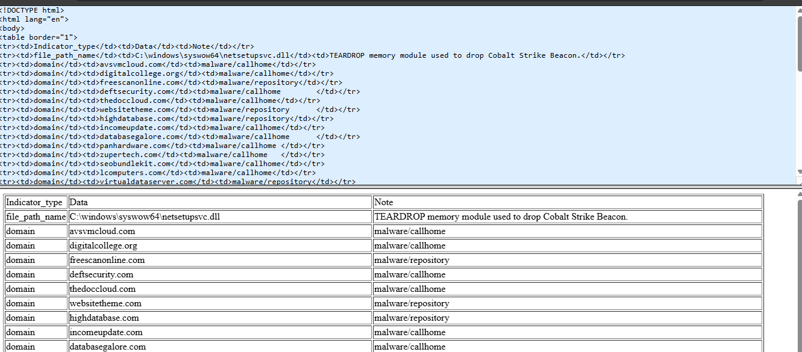

# CyberChef Recipes

This repository contains a list of CyberChef recipes you may find useful when working with data in cyber security. The repo is split into recipe types, each described below. Good luck with your data manipulations!


> CyberChef is the self-purported 'Cyber Swiss-Army Knife' created by GCHQ. It's a fantastic tool for data transformation, extraction & manipulation in your web-browser. For more details, visit https://gchq.github.io/CyberChef/.


## Tips for Getting Started

### Loading a Recipe
 
 1. Copy the recipe code under the "Code" section of recipe or from the associated `.json` file. The Code section conains the recipe in Chef format.
 2. Select the "Load recipe" button in CyberChef (folder icon).
 3. Paste in the code and press Load.


## Table of Contents

### [Malware Analysis](#malware-analysis)

#### -> [Decoding Base64 Encoded PowerShell](#decoding-base64-encoded-powershell)

#### -> [Extract Base64 and Inflate PowerShell Code](#extract-base64-and-inflate-powershell-code)

#### -> [Decoding CharCode](#decoding-charcode)

### [Web Tokens](#web-tokens) 

#### -> [Decoding JWT Tokens](#decoding-jwt-tokens)

#### -> [Decoding SAML](#decoding-saml)


### [Log Parsing](#log-parsing)

#### -> [Fomat Apache HTTP Access Log](#format-apache-http-access-log)

### [Images](#images)

#### -> [Extracting EXIF Data](#extract-exif-data)

### [Email](#email)

#### -> [Validate Email Address Using UserCheck.com](#validate-email-address-using-usercheckcom)

### [Data Formatting](#data-formating)

#### -> [Convert CSV File to HTML Table](#convert-csv-file-to-html-table)


## Malware Analysis

> Recipes for working extracting useful information from malware.


### Decoding Base64 Encoded PowerShell



Scripted malware will often use Base64 encoding to evade detection by automated tools. This CyberChef recipe extracts Base64 encoded data in a PowerShell command and decode it. Finally, it adds some formating to make it look better.

#### Code

```
Regular_expression('User defined','[a-zA-Z0-9+/=]{30,}',true,true,false,false,false,false,'List matches')
From_Base64('A-Za-z0-9+/=',true,false)
Decode_text('UTF-16LE (1200)')
Syntax_highlighter('auto detect')
```

### Extract Base64 and Inflate PowerShell Code



PowerShell malware will often use Base64 encoding with compression (e.g. `IO.Compression.DeflateStream`) to evade detection by automated tools. This CyberChef recipe extracts Base64 encoded data in a PowerShell command, decodes it, and decompresses (inflates) the code. Finally, it adds some formating to make it look better.

#### Recipe

```
Regular_expression('User defined','[a-zA-Z0-9+/=]{30,}',true,true,false,false,false,false,'List matches')
From_Base64('A-Za-z0-9+/=',true,false)
Raw_Inflate(0,0,'Adaptive',false,false)
Generic_Code_Beautify()
Syntax_highlighter('auto detect')
```

> Source: [mattnotmax](https://github.com/mattnotmax/cyberchef-recipes)

### Decoding CharCode

[Decodeing CharCode](./images/decoding-charcode.png)


"Charcode" (short for character code) refers to the numerical representation of a character. While legitimate in programming, it can be used maliciously in techniques like obfuscation, where attackers convert malicious code into its character code equivalents. This makes the code harder for security tools and human analysts to detect and understand, allowing exploits to bypass defenses.

This CyberChef recipe extracts charcode and converts it to it's character representation. It also includes a Jump operation you can use to bypass multiple layers of charcode obfuscation. Edit the "Maximum jumps" paraemter or disable to adjust/remove this functionality.

#### Recipe

```
Label('start')
Regular_expression('User defined','([0-9]{2,3}(,\\s|))+',true,true,false,false,false,false,'List matches')
From_Charcode('Comma',10)
Jump('start',1)
```


## Web Tokens

> CyberChef recipes to decode popular encoding formats.

### Decoding JWT Tokens



A JSON Web Token (JWT) is a compact, self-contained, and secure way to transmit information between parties as a JSON object. It's digitally signed to ensure the data hasn't been tampered with and is commonly used for stateless authentication, allowing servers to verify user identity without storing session information. Essentially, it's a trusted digital ID card that carries user data and permissions.

This CyberChef recipe can be used to decode a JSON Web Token to reveal it's header and payload information. See [jwt.io](https://jwt.io/) for extended usage.

#### Recipe

```
URL_Decode(true)
Fork('.','\\n',false)
From_Base64('A-Za-z0-9+/=',true,false)
Filter('Line feed','^{.*}$',false)
JSON_Beautify('    ',false,true)
```

> Source: [Thomas Leplus](https://github.com/thomasleplus/cyberchef-recipes)

### Decoding SAML



SAML, or Security Assertion Markup Language, is an open standard that allows secure exchange of authentication and authorization data between different online services. It primarily facilitates Single Sign-On (SSO), enabling users to log in once with one set of credentials and access multiple applications without re-authenticating. This works by having an Identity Provider (IdP) verify the user's identity and send an "assertion" (an XML document) to a Service Provider (SP), granting access.


This CyberChef recipe can be used to decode a SAML assertion  to reveal it's underlying XML information.

#### Recipe

```
URL_Decode(true)
From_Base64('A-Za-z0-9+/=',true,false)
Raw_Inflate(0,0,'Adaptive',false,true)
XML_Beautify('\\t')
```

> Source: [Thomas Leplus](https://github.com/thomasleplus/cyberchef-recipes)


## Log Parsing

> CyberChef recipes to parse log files for analysis.


### Format Apache HTTP Access Log



An Apache HTTP access log is a detailed record of every request made to an Apache web server. It contains information such as the client's IP address, the date and time of the request, the requested URL, the HTTP response code, and the user agent (browser/OS). These logs are crucial for monitoring website traffic, analyzing user behavior, troubleshooting issues, and identifying potential security threats.

This CyberChef recipe extracts information from one or more lines of an Apache HTTP access log and outputs it formatted with labels for easier reading. The date is converted to ISO format and the time zone is changed to UTC.

#### Recipe

```
Find_/_Replace({'option':'Regex','string':'^\\s*([^\\s].*[^\\s])\\s*$'},'$1',false,true,false,true)
Fork('\\n','\\n',false)
Subsection(' \\[([^\\]]+)\\] ',true,true,false)
Translate_DateTime_Format('Automatic','DD/MMM/YYYY:HH:mm:ss','UTC','YYYY-MM-DD HH:mm:ss ZZ','UTC')
Merge(false)
Register('^(\\S+) (\\S+) (\\S+) \\[([^\\]]+)\\] "(\\S+) (.*?) (\\S+)" (\\S+) (\\S+) "([^"]*)" "([^"]*)"',true,false,false)
Find_/_Replace({'option':'Regex','string':'.*'},'Client Request:\\n  Host:      $R0\\n  Date/Time: $R3\\n  Method:    $R4\\n  File/Path: $R5\\nWebserver Response:\\n  Status Code: $R7\\n  Bytes Sent:  $R8\\nInformation from Client:\\n  Referrer:   $R9\\n  User-Agent: $R10\\n',false,false,false,true)
```

> Source: [Gaijin.at](https://www.gaijin.at/en/infos/cyberchef-recipes)

## Images

> CyberChef recipes for working with images.


### Extract EXIF Data



EXIF (Exchangeable Image File Format) data is a standard for storing various "behind-the-scenes" details within digital image files. When you take a photo with a digital camera or smartphone, this metadata is automatically embedded. It includes information like camera settings (aperture, shutter speed, ISO), date and time of capture, camera make and model, and even GPS location if enabled. This data can be useful for organizing photos, analyzing shooting techniques, or even for forensic purposes.

This CyberChef recipe extracts EXIF information from a picture file and removes unnecessary information and formats the UNIX timestamps to an ISO date.

```
Extract_EXIF()
Find_/_Replace({'option':'Regex','string':'Found \\d+ tags.\\n\\n'},'',true,false,true,false)
Find_/_Replace({'option':'Regex','string':'\\n(StripOffsets|StripByteCounts): [^\\n]+'},'',true,false,true,false)
Subsection('\\n(?:ModifyDate|DateTimeOriginal): (\\d+)',true,true,false)
Translate_DateTime_Format('UNIX timestamp (seconds)','X','UTC','YYYY-MM-DD HH:mm:ss z','UTC')
```

> Source: [Gaijin.at](https://www.gaijin.at/en/infos/cyberchef-recipes)


## Email

> CyberChef recipes for working with emails.

### Validate Email Address Using UserCheck.com


UserCheck.com is a service that helps website owners and businesses combat spam and fake user registrations by identifying and blocking disposable or temporary email addresses. It provides an API that allows real-time validation of email addresses against an constantly updated database of known disposable email domains. This helps to ensure that only legitimate users with permanent email addresses can sign up or comment on a site, improving data quality and reducing spam.

This CyberChef recipe queries information about one or more mail addresses via the usercheck.com service and formats the result.

> Note: You can sign up to use the API for free. Just replace the Bearer token in the HTTP request `<token>` with yours.

#### Recipe

```
Fork('\\n','\\n',false)
Register('([\\s\\S]*)',true,false,false)
HTTP_request('GET','https://api.usercheck.com/email/$R0','Authorization: Bearer <token>','Cross-Origin Resource Sharing',false)
Find_/_Replace({'option':'Simple string','string':'{'},'$R0:\\n{',true,false,true,false)
Merge(true)
Find_/_Replace({'option':'Simple string','string':'"'},'',true,false,true,false)
Find_/_Replace({'option':'Regex','string':':'},': ',true,false,true,false)
Find_/_Replace({'option':'Simple string','string':'{'},'    ',true,false,true,false)
Find_/_Replace({'option':'Simple string','string':'}'},'\\n',true,false,true,false)
Find_/_Replace({'option':'Simple string','string':','},'\\n    ',true,false,true,false)
```

> Source: [Gaijin.at](https://www.gaijin.at/en/infos/cyberchef-recipes)

## Data Formating 

> CyberChef recipes for generating reports and foramtting data.

### Convert CSV File to HTML Table





A CSV (Comma-Separated Values) file is a plain text file format used to store tabular data, with each value in a row separated by a comma. Each new line in the file indicates a new row of data. This simple, widely compatible format is commonly used for exchanging data between different applications, databases, and spreadsheets

This CyberChef recipe takes a CSV file and converts it into a HTML table so it can be included in a web application/report. 

#### Recipe

```
Find_/_Replace({'option':'Extended (\\n, \\t, \\x...)','string':','},'</td><td>',true,false,true,false)
Find_/_Replace({'option':'Regex','string':'^(.*)$'},'<tr><td>$1</td></tr>',true,false,true,false)
Find_/_Replace({'option':'Regex','string':'(.*)'},'<!DOCTYPE html>\\n<html lang="en">\\n<body>\\n<table border="1">\\n$1\\n</table>\\n</body>\\n</html>\\n',false,false,true,true)
```


